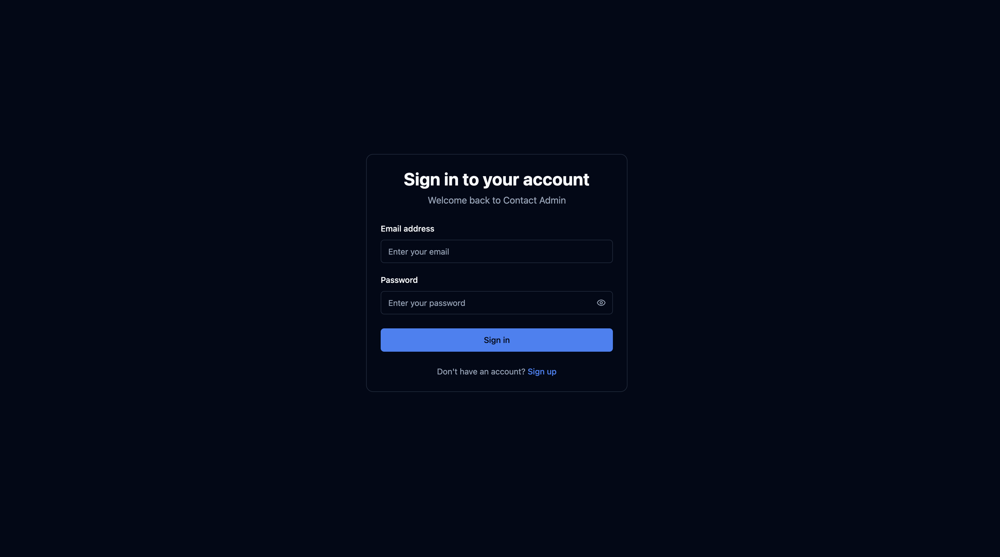
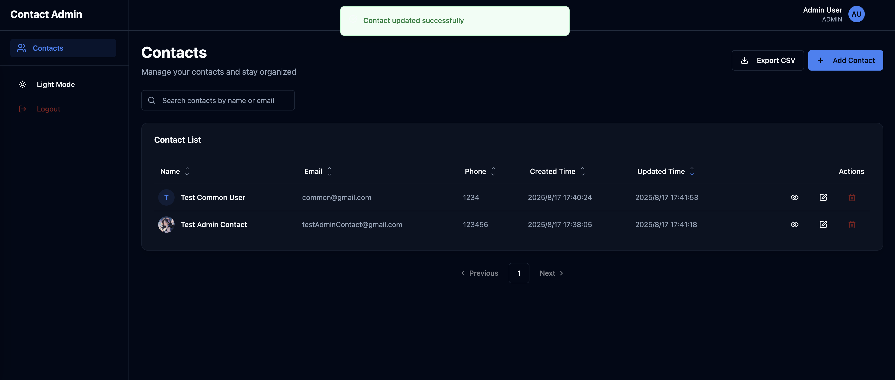

# Contact-Management-App

A full-stack Contact Management App with complete CRUD functionality, user authentication, and role-based access control.

## 🏗️ Project Structure

This repository contains two main projects:

- **Backend** - NestJS API server with Prisma ORM and PostgreSQL
- **Frontend** - React application with TypeScript and Tailwind CSS

## 🚀 Quick Start

### Backend
Navigate to the backend directory and follow the setup instructions:
See [Backend README](./backend/README.md) for detailed setup instructions.

### Frontend
Navigate to the frontend directory and install dependencies:
See [Frontend README](./frontend/README.md) for detailed setup instructions.

### Page Display

#### Authentication Pages

*User login interface*


*User registration interface*

#### Contact Management

*Add new contact form*


*Contact list and management interface*

## 🛠️ Tech Stack

### Backend
- **Framework**: NestJS
- **Database**: PostgreSQL with Prisma ORM
- **Authentication**: JWT tokens
- **API Documentation**: Swagger

### Frontend
- **Framework**: React with TypeScript
- **Styling**: Tailwind CSS
- **State Management**: Zustand
- **UI Components**: Custom components with shadcn/ui

## 📁 Repository Structure

```
Contact-Management-App/
├── backend/          # NestJS API server
├── frontend/         # React application
└── README.md         # This file
```

## 🔧 Development

Both projects can be developed independently. Each has its own package.json and dependencies.

## 📝 License

This project is open source and available under the [MIT License](LICENSE).
